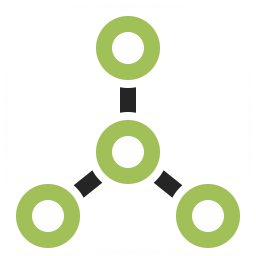

<p align="center">
	
</p>
 
<p align="center">
	a zero dependency performant graph query resolver
</p>

<p align="center">
	<a href="https://opensource.org/licenses/MIT" target="_blank" alt="License">
		
	</a>
	<a href="https://pkg.go.dev/github.com/aacebo/gq" target="_blank" alt="Go Reference">
		
	</a>
	<a href="https://goreportcard.com/report/github.com/aacebo/gq" target="_blank" alt="Go Report Card">
		
	</a>
	<a href="https://github.com/aacebo/owl/actions/workflows/ci.yml" target="_blank" alt="Build">
		
	</a>
	<a href="https://codecov.io/gh/aacebo/gq"> 
		 
	</a>
</p>

# Install

```bash
go get github.com/aacebo/gq
```

# Features

| Name			             		  	| Status			   	 |
|---------------------------------------|------------------------|
| [Any](./docs/00.any.md)			  	| ✅					  	|
| [String](./docs/01.string.md)		  	| ✅					  	|
| [Int](./docs/02.int.md)			  	| ⌛					  	|
| [Float](./docs/03.float.md)		  	| ⌛					  	|
| [Bool](./docs/04.bool.md)			  	| ✅					  	|
| [Date](./docs/05.date.md)			  	| ✅					  	|
| [Object](./docs/06.object.md)		  	| ✅				  	  	|
| [List](./docs/07.list.md)	 		  	| ✅				  	  	|
| [Namespace](./docs/08.namespace.md) 	| ✅					  	|
| [Middleware](./docs/09.middleware.md)	| ✅				  	  	|

# Related

- [Schema Validation](https://github.com/aacebo/owl)
